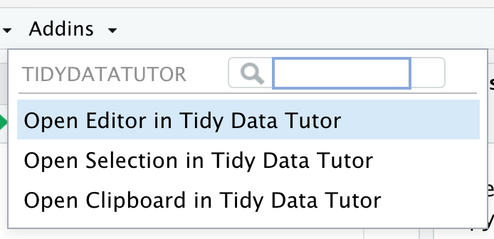

# tidydatatutor

<!-- badges: start -->
[](https://github.com/seankross/tidydatatutor/actions)
<!-- badges: end -->

Connect R and RStudio to [Tidy Data Tutor](https://tidydatatutor.com).

## Installation

You can install the development version of tidydatatutor from [GitHub](https://github.com/) with:

``` r
# install.packages("remotes")
remotes::install_github("seankross/tidydatatutor")
```

## Getting Started

Send a string of code to Tidy Data Tutor:

```r
code = 
"library(dplyr)
library(palmerpenguins)

penguins %>%
  select(species, bill_length_mm) %>%
  group_by(species) %>%
  arrange(desc(bill_length_mm), .by_group = TRUE) %>% 
  slice(1)"
  
tidydatatutor::go_code(code)
```

Copy the following code into the clipboard:

```r
library(dplyr)
library(palmerpenguins)

penguins %>%
  select(species, bill_length_mm) %>%
  group_by(species) %>%
  arrange(desc(bill_length_mm), .by_group = TRUE) %>% 
  slice(1)
```

Then open it in Tidy Data Tutor by running this in the console:

```r
tidydatatutor::go_paste()
```

## RStudio Add-in

Access Tidy Data Tutor from the Addins drop down menu in RStudio:

<p align="left"></p>
